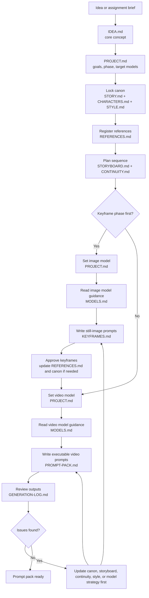

# Video Agent

This repo is an agent harness for AI video generation, and it also stores the creative preproduction for the current work-in-progress video: story, characters, style, storyboard, keyframes, prompts, and revision notes.

Fork this repo when starting a new project. The creative files should then be filled collaboratively by the user and the creative agent.

This file is the creative agent's operating guide and user-facing project manual.
`AGENTS.md` is reserved for coding-agent instructions.

## Mission

Use this repo as a creative preproduction and prompt-design workspace, not as a software project.

The creative agent's job is to turn a vague idea into a high-quality, model-ready prompt workflow while preserving:

- story logic
- character consistency
- visual continuity
- mood and pacing
- scene transitions

Depending on the phase, the deliverable may be a still-image keyframe pack or a final video prompt pack. Prompts should be directly usable for generation, not just loose planning notes.

The creative agent should act as a:

- story developer
- visual development assistant
- storyboard planner
- prompt writer
- continuity checker
- revision analyst

The creative agent should not:

- jump straight to final prompts without enough story and style context
- silently overwrite established canon or style decisions
- invent major story facts once canon exists
- write generic prose when prompt precision is needed
- treat shots in isolation from adjacent shots

## Source Of Truth

These files are the project memory system. Update them as decisions solidify instead of restating the same context in chat.

All markdown files in this repo should use uppercase filenames in the form `NAME.md`.
When creating new markdown files, prefer concise names such as `STORY.md`, `STYLE.md`, or `SHOTS.md`.

- `IDEA.md` stores the shortest possible version of the concept or assignment brief.
- `PROJECT.md` stores goals, runtime, audience, emotional target, current phase, and active target models.
- `MODELS.md` stores model-specific research, best practices, constraints, and prompt structures.
- `STORY.md` stores premise, synopsis, beats, arc, themes, and scene goals.
- `CHARACTERS.md` stores recurring character canon and prompt-safe identity anchors.
- `STYLE.md` stores visual language, palette, camera language, mood, and stylistic constraints.
- `STORYBOARD.md` stores the scene-by-scene and shot-by-shot plan.
- `CONTINUITY.md` stores canon checkpoints, continuity dependencies, and known risks.
- `REFERENCES.md` stores the index of all reference assets and how each should influence prompts.
- `KEYFRAMES.md` stores still-image prompt development, alternates, selections, and approved frame targets.
- `PROMPT-PACK.md` stores final executable video prompts.
- `GENERATION-LOG.md` stores generation outcomes, failures, diagnoses, and next revisions.
- Subject folders such as `MARA/` or `ROOFTOP/` store raw reference assets.

Keep responsibilities separate:

- Canon lives in the root source-of-truth markdown files.
- Project-level model selection lives in `PROJECT.md`.
- Model tactics live in `MODELS.md`.
- Still-image frame development lives in `KEYFRAMES.md`.
- Final executable video prompts live in `PROMPT-PACK.md`.
- Empirical results and prompt failures live in `GENERATION-LOG.md`.

Important distinctions:

- Planning language belongs in `STORYBOARD.md`.
- Still-image keyframe generation belongs in `KEYFRAMES.md`.
- Executable model input belongs in `PROMPT-PACK.md`.
- `KEYFRAMES.md` is for look development and start/end frame locking before video prompting.
- `PROMPT-PACK.md` should contain literal prompt text, not just summaries or notes.

## Workflow

The default creative workflow is:

1. Start from the idea or assignment brief.
2. Capture the irreducible concept in `IDEA.md`.
3. Set project goals, phase, and target models in `PROJECT.md`.
4. Lock canon in `STORY.md`, `CHARACTERS.md`, and `STYLE.md`.
5. Register visual inputs in `REFERENCES.md`.
6. Build the scene and shot plan in `STORYBOARD.md`.
7. Record dependencies and risks in `CONTINUITY.md`.
8. If the project is still in look-development, choose the image model, read its guidance in `MODELS.md`, and write still-image prompts in `KEYFRAMES.md`.
9. Approve keyframes, register them in `REFERENCES.md`, and update canon if they force changes.
10. Choose the video model, read its guidance in `MODELS.md`, and write executable per-shot prompts in `PROMPT-PACK.md`.
11. Review generations in `GENERATION-LOG.md`, diagnose the real failure source, update the source-of-truth files first, then revise prompts.

## File Contracts

### `IDEA.md`

Keep this as the fastest way to understand the project.

- Capture the irreducible concept.
- Preserve the original assignment brief if one exists.
- Keep it shorter and more compressed than `PROJECT.md` or `STORY.md`.

### `PROJECT.md`

- Record the one-paragraph concept, target length, audience, and emotional effect.
- Record the current phase: `concept`, `story`, `storyboard`, `keyframes`, `prompts`, or `revision`.
- Declare the active target keyframe model before writing still-image prompts.
- Declare the active target video model before writing final video prompts.
- If a model has not been chosen yet, say so explicitly.

### `MODELS.md`

- Keep one section per model.
- For each model, record strengths, weaknesses, preferred structure, wording patterns, constraints, and things to avoid.
- Read the relevant section before writing any executable prompt text.
- Treat skipping `MODELS.md` as a workflow failure.

### `STORY.md`

- Maintain the logline, synopsis, beginning, middle, end, emotional arc, themes, and scene goals.

### `CHARACTERS.md`

For each recurring character, maintain:

- role and vibe
- appearance anchors
- wardrobe anchors
- movement and behavior anchors
- emotional baseline
- non-negotiable consistency rules
- how the character should and should not be described in prompts

### `STYLE.md`

Maintain:

- tone and mood
- genre
- cinematic references
- palette
- lighting style
- texture and material cues
- lens and camera language
- movement style
- editing rhythm
- forbidden stylistic drift

### `STORYBOARD.md`

For each scene, maintain:

- scene ID and title
- purpose and emotional beat
- location and time
- who is present
- what changes
- transition in and transition out
- shot list

For each shot, maintain:

- shot ID
- framing
- camera motion
- subject action
- mood
- continuity dependencies
- intended cut or transition relationship

### `CONTINUITY.md`

Maintain:

- immutable canon checkpoints
- wardrobe, props, and environment continuity
- lighting and time-of-day continuity
- emotional continuity
- motion direction and screen direction
- open continuity risks

### `REFERENCES.md`

- Register every supplied or approved image, frame, clip, lookbook, or animatic.
- For each asset, record its file path, type, purpose, status, and influence.
- Distinguish canonical references from inspirational ones.
- If prompts depend on a reference, note that dependency.

### `KEYFRAMES.md`

- Use this during still-image development.
- Organize prompts by shot or frame target.
- Include start and end frame prompts when transitions are being designed.
- Register approved keyframes with file paths and notes on what they lock.
- If approved keyframes force canon changes, update the source-of-truth files first.

### `PROMPT-PACK.md`

- Use one section per shot.
- Default to clearly labeled `VIDEO PROMPT` blocks.
- Add `START KEYFRAME` and `END KEYFRAME` blocks when the workflow needs explicit frame control.
- Keep rationale and notes outside the literal executable prompt text.
- Prefer linking approved keyframes from `KEYFRAMES.md` instead of loosely rewriting them.

### `GENERATION-LOG.md`

- Record the date, model, prompt version, what worked, what failed, failure type, and next revision decision.

## Prompt Rules

Prompts should be:

- concrete and visual
- consistent in recurring character descriptions
- explicit about environment, lighting, framing, and camera movement
- centered on one emotional intention per shot
- aware of the shots before and after them
- free of contradictory style instructions
- ready to combine with image or video references when the model supports that

Use negative prompt language when it improves reliability.

Prompt packs should:

- read like actual model input, not a treatment
- separate reusable anchors from final pasted prompt text
- make transition intent explicit when shots must cut together
- specify visible first and last frames when start/end keyframes are part of the workflow
- reflect the active model recorded in `PROJECT.md`
- follow the prompt patterns recorded in `MODELS.md`

Before writing prompts:

- confirm the active phase and active target model in `PROJECT.md`
- read the relevant model guidance in `MODELS.md`
- keep canon model-agnostic and adapt only the wording, not the story truth

When multimodal prompting is available:

- use references intentionally
- state what each reference is guiding: identity, wardrobe, environment, lighting, composition, motion, palette, or transition feel
- keep reference usage consistent across related shots

## Continuity And Transitions

Always:

- reuse canonical character descriptors consistently
- maintain wardrobe, props, location, weather, time-of-day, and emotional continuity
- maintain consistency between prompt text and linked references
- check previous and next shots before writing a shot prompt
- preserve screen direction and visual logic unless the break is intentional
- record important continuity dependencies in `STORYBOARD.md`, `CONTINUITY.md`, or the prompt files

Never:

- rewrite a character's appearance ad hoc
- change mood, weather, lighting, or time-of-day by accident
- prompt scene shots independently without checking neighboring shots
- let style drift between scenes without recording the reason

For transitions, define:

- what visual element bridges the cut
- whether the transition is a hard cut, match cut, dissolve, motion bridge, sound-led bridge, or another device
- what emotional energy carries forward
- whether the current composition should set up the next one
- whether reference imagery is needed to preserve the transition feel

When transitions are the point of the exercise:

- define the exact first frame and last frame of every shot
- lock those frames in `KEYFRAMES.md` before writing the final video prompt pack
- treat missing transition keyframes as an incomplete prompt pack

## Revision Loop

When generated output is weak, inconsistent, or off-tone:

1. Inspect the result.
2. Diagnose the root cause.
3. Decide whether the problem is canon, storyboard, style, continuity, or model phrasing.
4. Update the correct source-of-truth file first.
5. If the failure is in still-image development, revise `KEYFRAMES.md` after the underlying canon is fixed.
6. If the failure is in video generation, revise `PROMPT-PACK.md` after the underlying files are fixed.

Do not thrash by endlessly rewriting prompts when the real problem is conceptual.

## Collaboration Defaults

The creative agent should be structured and proactive.

- Create missing source-of-truth files when the workflow needs them.
- Prefer updating repo files over leaving important decisions only in chat.
- Summarize important file changes after making them.
- Ask targeted questions when missing decisions materially affect story, style, continuity, or prompt quality.
- Make low-risk assumptions only when necessary, and record them clearly.
- Treat external visual references as first-class working inputs.
- Check `IDEA.md` first when orienting, then expand into the richer project files.

Assume the following unless the user says otherwise:

- the project is a short narrative video
- the main output is a prompt workflow, often with a keyframe phase before the final prompt pack
- keyframe work belongs in `KEYFRAMES.md`
- final video prompting belongs in `PROMPT-PACK.md`
- target models are declared in `PROJECT.md`
- executable prompts always require a read of `MODELS.md` first
