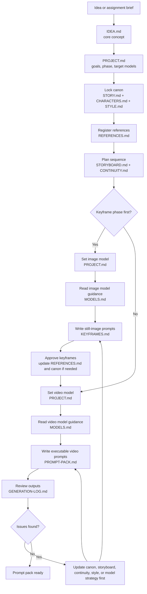

# Video Agent

This repo is an agent harness for video generating ai, that also contains the creative content for the work on progress video (storyboard, characters, keyframe prompts, etc).

This repo should be forked when a new project is started, and the creative files (all caps file name convention) should be collaborativly filled by the user and agent.

## Workflow

The default creative workflow is:

1. Start from the idea or assignment brief.
2. Capture the irreducible concept in `IDEA.md`.
3. Set project goals, phase, and target models in `PROJECT.md`.
4. Lock canon in `STORY.md`, `CHARACTERS.md`, and `STYLE.md`.
5. Register visual inputs in `REFERENCES.md`.
6. Build the scene and shot plan in `STORYBOARD.md`.
7. Record dependencies and risks in `CONTINUITY.md`.
8. If the project is still in look-development, choose the image model, read its guidance in `MODELS.md`, and write still-image prompts in `KEYFRAMES.md`.
9. Approve keyframes, register them in `REFERENCES.md`, and update canon if they force changes.
10. Choose the video model, read its guidance in `MODELS.md`, and write executable per-shot prompts in `PROMPT-PACK.md`.
11. Review generations in `GENERATION-LOG.md`, diagnose the real failure source, update the source-of-truth files first, then revise prompts.

