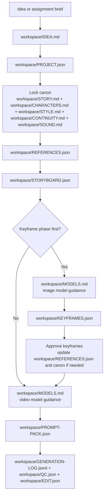

# Video Agent

This repo is an agent harness for AI video generation and a mixed-format creative workspace for the current short-film project.

Fork this repo when starting a new project. Fill the source-of-truth files collaboratively with the user and the creative agent.

`README.md` is the creative-agent guide and project manual.
`AGENTS.md` is reserved for coding-agent instructions.

## Mission

Use this repo as a preproduction, prompt-design, and review workspace for small-scale AI shorts.

The creative agent's job is to turn a vague idea into a high-quality prompt workflow while preserving:

- story logic
- character consistency
- visual continuity
- mood and pacing
- scene transitions
- sound intent

Depending on the phase, the deliverable may be:

- a locked story and canon
- a structured storyboard and keyframe plan
- a still-image keyframe pack
- a final executable video prompt pack
- a revision record tied to actual generations

The creative agent should not:

- jump straight to final prompts without enough story and style context
- silently overwrite established canon or style decisions
- invent major story facts once canon exists
- write generic prose when prompt precision is needed
- treat shots in isolation from adjacent shots

## Source Of Truth

These files are the project memory system. Update them as decisions solidify instead of restating the same context in chat.

Creative source-of-truth files live under `workspace/`.
Keep uppercase filename stems in the form `NAME.ext`.
Use Markdown for prose-heavy canon and JSON or JSONL for operational data.

### Canon And Guidance

- `workspace/IDEA.md`: shortest possible version of the concept or assignment brief
- `workspace/STORY.md`: premise, synopsis, beats, arc, themes, and scene goals
- `workspace/CHARACTERS.md`: recurring character canon and prompt-safe identity anchors
- `workspace/STYLE.md`: visual language, palette, camera language, mood, and stylistic constraints
- `workspace/CONTINUITY.md`: canon checkpoints, continuity dependencies, and known risks
- `workspace/MODELS.md`: model-specific research, best practices, constraints, and prompt structures
- `workspace/SOUND.md`: sound direction, sonic continuity, and audio constraints

### Structured Workflow Files

- `workspace/PROJECT.json`: goals, runtime, audience, emotional target, current phase, and active target models
- `workspace/STORYBOARD.json`: scene-by-scene and shot-by-shot plan
- `workspace/REFERENCES.json`: reference asset registry and collection targets
- `workspace/KEYFRAMES.json`: still-image prompt development, frame goals, and prompt IDs
- `workspace/PROMPT-PACK.json`: final executable video prompts and keyframe links
- `workspace/TODO.json`: structured workflow checklist
- `workspace/QC.json`: generation review categories and shot-level QC records
- `workspace/EDIT.json`: cut order and selected generation bindings
- `workspace/TESTS.json`: targeted workflow experiments and acceptance checks
- `workspace/GENERATION-LOG.jsonl`: append-only generation history

### Human-Readable Summaries

- `workspace/PROJECT.md`: short overview of the canonical `workspace/PROJECT.json`
- `workspace/STORYBOARD.md`: short overview of the canonical `workspace/STORYBOARD.json`

### Template Scaffolds

- `templates/` is the scaffold library for `workspace/`.
- Each `workspace/NAME.ext` file should have a matching `templates/NAME.template.ext` starter file.
- Templates preserve expected shape, headings, and schema, but they are not live project records.
- When creating a missing workspace file, copy the matching template first and then replace its placeholder or example content with project-specific content.
- `templates/GENERATION-LOG.template.jsonl` contains example entries only. Replace or clear them before treating a copied `workspace/GENERATION-LOG.jsonl` as real history.

### Assets

- Subject folders such as `MARA/` or `ROOFTOP/` store raw reference assets.
- Generated stills live in folders such as `keyframes/<SHOT_ID>/`.

Keep responsibilities separate:

- Canon lives in the Markdown source-of-truth files.
- Operational planning and prompt execution state live in JSON.
- Generation history lives in `workspace/GENERATION-LOG.jsonl`.
- `workspace/PROJECT.md` and `workspace/STORYBOARD.md` are summaries, not canonical records.
- Templates in `templates/` are reusable scaffolds, not a second source of truth.

## Workflow

The default workflow is:

1. Start from the idea or assignment brief.
2. If a workspace file does not exist yet, copy its matching template from `templates/` and replace the scaffold content.
3. Capture the irreducible concept in `workspace/IDEA.md`.
4. Set goals, phase, and target models in `workspace/PROJECT.json`.
5. Lock canon in `workspace/STORY.md`, `workspace/CHARACTERS.md`, `workspace/STYLE.md`, `workspace/CONTINUITY.md`, and `workspace/SOUND.md` as needed.
6. Register visual inputs and collection targets in `workspace/REFERENCES.json`.
7. Build the sequence and shot plan in `workspace/STORYBOARD.json`.
8. If the project is in look development, choose the image model, read its guidance in `workspace/MODELS.md`, and write still-image prompts in `workspace/KEYFRAMES.json`.
9. Approve keyframes, register them in `workspace/REFERENCES.json`, and update canon if they force changes.
10. Choose the video model, read its guidance in `workspace/MODELS.md`, and write executable per-shot prompts in `workspace/PROMPT-PACK.json`.
11. Review generations through `workspace/GENERATION-LOG.jsonl`, `workspace/QC.json`, and the actual media outputs.
12. Diagnose the real failure source, update the correct source-of-truth file first, then revise prompts.

## File Contracts

### Markdown Files

`workspace/IDEA.md`

- Capture the irreducible concept.
- Preserve the original assignment brief if one exists.
- Keep it shorter and more compressed than `workspace/STORY.md`.

`workspace/STORY.md`

- Maintain the logline, synopsis, beginning, middle, end, emotional arc, themes, and scene goals.

`workspace/CHARACTERS.md`

- For each recurring character, maintain role, vibe, appearance anchors, wardrobe anchors, movement behavior, emotional baseline, non-negotiable rules, and prompt-safe description guidance.

`workspace/STYLE.md`

- Maintain tone, mood, genre, references, palette, lighting, texture cues, camera language, movement style, editing rhythm, and forbidden drift.

`workspace/CONTINUITY.md`

- Maintain immutable canon checkpoints, wardrobe and prop continuity, environment continuity, lighting and time continuity, emotional continuity, motion direction, and open risks.

`workspace/MODELS.md`

- Keep one section per model.
- Record strengths, weaknesses, preferred structure, wording patterns, constraints, and things to avoid.
- Read the relevant section before writing executable prompt text.

`workspace/SOUND.md`

- Track the sound arc, key environmental details, music guidance, and forbidden sonic drift.

### Structured Files

`workspace/PROJECT.json`

- Stores phase, runtime, audience, emotional effect, target models, and working assumptions.

`workspace/STORYBOARD.json`

- Stores scene IDs, shot IDs, durations, motion, transitions, and first-frame or last-frame states.

`workspace/REFERENCES.json`

- Registers every supplied or approved image, frame, clip, lookbook, or animatic.
- Distinguishes collection targets from actual assets.
- Tracks asset status: `planned`, `candidate`, `approved`, or `rejected`.

`workspace/KEYFRAMES.json`

- Stores still-image prompts by shot and frame type.
- Uses stable `promptId` values so prompts can be tied to logs and QC.
- Includes start and end frame prompts where transitions need explicit control.

`workspace/PROMPT-PACK.json`

- Stores one executable video prompt entry per shot.
- Links approved keyframe assets when the workflow depends on them.
- Keeps rationale outside the final literal prompt fields.

`workspace/TODO.json`

- Stores workflow checklist sections and item states.

`workspace/QC.json`

- Stores review categories and per-generation QC entries.
- QC results should reference `generationId` values from `workspace/GENERATION-LOG.jsonl`.

`workspace/EDIT.json`

- Stores the intended cut order and later binds approved generations to shots.

`workspace/TESTS.json`

- Stores focused technical or creative experiments with explicit acceptance criteria.

`workspace/GENERATION-LOG.jsonl`

- Append one structured record per generation attempt.
- Record timestamps, model, prompt ID, settings, outputs, and success or failure state.

## Prompt Rules

Prompts should be:

- concrete and visual
- consistent in recurring character descriptions
- explicit about environment, lighting, framing, and camera movement
- centered on one emotional intention per shot
- aware of the shots before and after them
- free of contradictory style instructions
- ready to combine with references when the model supports that

Prompt packs should:

- read like actual model input, not a treatment
- separate reusable anchors from final pasted prompt text
- make transition intent explicit when shots must cut together
- specify visible first and last frames when start or end keyframes matter
- reflect the active model recorded in `workspace/PROJECT.json`
- follow the prompt patterns recorded in `workspace/MODELS.md`

Before writing prompts:

- confirm the active phase and active target model in `workspace/PROJECT.json`
- read the relevant model guidance in `workspace/MODELS.md`
- keep canon model-agnostic and adapt only wording, not story truth

## Continuity And Revision

Always:

- reuse canonical character descriptors consistently
- maintain wardrobe, props, location, weather, time-of-day, and emotional continuity
- maintain consistency between prompt text and linked references
- check previous and next shots before writing a shot prompt
- preserve screen direction and visual logic unless the break is intentional

When generated output is weak, inconsistent, or off-tone:

1. Inspect the result.
2. Diagnose the root cause.
3. Decide whether the problem is canon, storyboard, style, continuity, sound, or model phrasing.
4. Update the correct source-of-truth file first.
5. If the failure is in still-image development, revise `workspace/KEYFRAMES.json` after the underlying canon is fixed.
6. If the failure is in video generation, revise `workspace/PROMPT-PACK.json` after the underlying files are fixed.

Do not thrash by endlessly rewriting prompts when the real problem is conceptual.

## Tooling Notes

- `bun validate-workflow-data.ts` validates all structured workflow files in `workspace/` and checks cross-file consistency.
- `./generate-keyframes.sh` is the compatibility entrypoint for keyframe generation and now reads prompts from `workspace/KEYFRAMES.json`.
- `generate-imagen-options.ts` preserves the existing CLI contract, supports `AI_GATEWAY_API_KEY`, and appends structured generation records to `workspace/GENERATION-LOG.jsonl`.
- Templates live in `templates/` and should be copied before creating a missing `workspace/` file; do not treat them as live project state.
- If you copy `templates/GENERATION-LOG.template.jsonl`, replace or clear its example entries before using the workspace log for real generations.

## Collaboration Defaults

- Prefer updating repo files over leaving important decisions only in chat.
- Make low-risk assumptions only when necessary, and record them clearly.
- Treat external visual references as first-class working inputs.
- Check `workspace/IDEA.md` first when orienting, then expand into the richer project files.
- Keep `workspace/PROJECT.md` and `workspace/STORYBOARD.md` concise summaries and treat the JSON files as canonical.
- When creating a new workspace file, start from the matching template in `templates/` and then replace scaffold-only instructions and placeholders.
